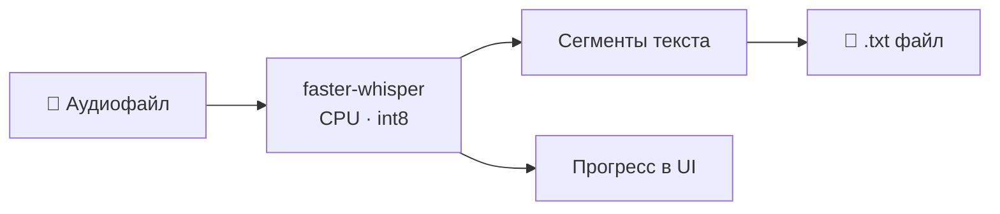

# Speech2Text Whisper

Десктопное приложение для транскрипции аудио в текст. Работает **полностью офлайн** на CPU, используя модель [OpenAI Whisper](https://github.com/openai/whisper) через [faster-whisper](https://github.com/SYSTRAN/faster-whisper).

## Возможности

- Графический интерфейс с выбором файлов, настройками и прогресс-баром
- Пакетная обработка нескольких файлов за один раз
- Консольный режим для автоматизации и скриптов
- Поддержка форматов: mp3, wav, m4a
- Выбор модели: tiny / base / small / medium / large
- Русский и английский язык (или авто-определение)
- Настройки сохраняются между запусками

## Как это работает



## Установка

> Первый запуск скачает модель Whisper (~150 МБ для small). Нужен интернет.

### Windows

1. Установить [Python 3.12+](https://www.python.org/downloads/) — при установке включить галочку **«Add Python to PATH»**
2. Запустить `setup.bat` — установит uv и все зависимости
3. Запустить `run.bat` — откроет приложение

### macOS

```bash
chmod +x setup.sh run.sh
./setup.sh   # установка
./run.sh     # запуск
```

## Использование

### GUI

Запустите `run.bat` (Windows) или `./run.sh` (macOS).

1. Нажмите **«Добавить...»** и выберите аудиофайлы
2. Выберите модель, язык и папку для результатов
3. Нажмите **«Распознать»**

Текст будет сохранён в файлы вида `имя_файла_2025-08-29.txt`.

### Консоль

```bash
python main.py [папка] [модель] [выходная_папка] [язык]

# Примеры:
python main.py
python main.py ./audio small transcripts ru
python main.py ./audio large ./results en
```

## Модели Whisper

| Модель | Скорость | Качество | Размер |
|--------|----------|----------|--------|
| tiny   | ★★★★★   | ★☆☆☆☆   | ~75 МБ |
| base   | ★★★★☆   | ★★☆☆☆   | ~145 МБ |
| small  | ★★★☆☆   | ★★★☆☆   | ~465 МБ |
| medium | ★★☆☆☆   | ★★★★☆   | ~1.5 ГБ |
| large  | ★☆☆☆☆   | ★★★★★   | ~3 ГБ |

**Рекомендация:** `small` — хороший баланс скорости и качества для большинства задач.

## Структура проекта

```
├── gui.py           # Графический интерфейс (tkinter)
├── main.py          # Консольный режим
├── transcriber.py   # Логика транскрипции (shared)
├── setup.bat        # Установка на Windows
├── run.bat          # Запуск на Windows
├── setup.sh         # Установка на macOS
└── run.sh           # Запуск на macOS
```

## Лицензия

[MIT](LICENSE)
